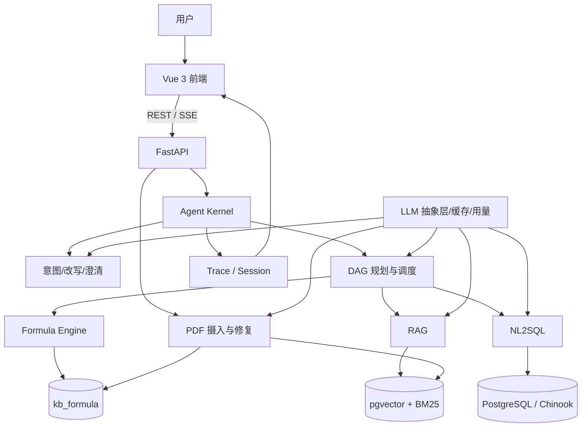

# 多模态数据驱动的可解释精准问数/问答智能体设计实验报告

> 版本：v0.7（第 0～3 章验收计划补强版，2026-10-08）  
> 项目：“中国电子杯”第三届高校 ICT 产教融合创新大赛·赛题八  
> 系统名称：问迹——多模态数据驱动的可解释精准问数/问答智能体

**摘要：** 针对企业数据库与制度文档相互割裂、自然语言查询门槛高以及大模型答案难以核验的问题，本文设计并实现“问迹”可解释问数/问答智能体。系统以事件驱动 Agent 为核心，统一编排 NL2SQL、RAG、跨源依赖 DAG、文档公式计算和多轮澄清；以检索式要素中台、SQL 校验与自修复、证据约束生成和全链路 Trace 提升准确性与可解释性。在项目内部固定评测集上，DeepSeek 配置取得 NL2SQL 31/31、多轮 14/14、跨源 11/11；常规 RAG 的检索、答案和忠实度均为 8/8。Schema Linking 在保持该评测集准确率的同时将平均候选表数由 7.5 降至 2.1，Schema token 约减少 74%。系统已形成从文档摄入、任务执行到前端展示和分级评测的完整闭环。

**关键词：** NL2SQL；检索增强生成；跨源推理；可解释智能体；文档公式计算

## 0. 核心亮点与成果

### 0.1 项目定位

“问迹”面向企业数据查询和制度文档问答。用户可以查询数据库指标、检索 PDF，也可以提出同时依赖两类数据源的问题。系统不仅返回答案，还展示 SQL、数据结果、文档引用、公式参数、计算步骤和任务依赖，使结果可核验、过程可回放、实验可复现。

### 0.2 核心创新

| 创新点 | 关键设计 | 区别于常见方案 | 实验证据 |
|---|---|---|---|
| 检索式要素中台 | 别名、指标、实体和 Schema 语义外置；字面+向量召回后精排 | 不依赖不断追加 Few-Shot，新领域主要扩充资产库 | 候选表 7.5→2.1，Schema token 约 -74%，准确率仍为 31/31 |
| 真依赖 DAG | 子任务声明 `depends_on`，按拓扑波次并行与汇合 | 不是把多工具调用伪装成一段线性模型回答 | 五类跨源 11/11，Trace 可见依赖边和子任务结果 |
| 原生可解释 Trace | 意图、改写、计划、工具、模型、校验、计算和融合统一成事件树 | 不展示不可验证的“思维过程”，只展示真实执行证据 | 前端时间线/DAG、SQL、Citation、公式步骤和 `turn_id` 回放均已接入 |
| 证据约束 RAG | Dense+BM25+RRF+Rerank，回答后逐句 factcheck | 将检索命中、答案命中和忠实度分开评估 | 常规集三项均 8/8，对抗错误事实/引用修复 3/3 |
| 可执行公式资产 | FormulaIR、三通道参数绑定、SymPy 与受限求值交叉验证 | 不让模型直接心算，也不允许 LLM 输出绕过本地校验 | Jane 提成 24.9912；4/4 数值门禁一致 |
| 质量—成本一体化评测 | L0/L1/L2、响应缓存、内容哈希、purpose 用量账本 | 准确率、稳定性和费用使用同一运行记录审计 | 主备模型重复结果稳定；未变化文档跳过付费公式抽取 |

### 0.3 关键成果

| 维度 | 结果 |
|---|---:|
| NL2SQL | 31/31，首过约 97% |
| Schema Linking | 平均候选表 7.5→2.1，Schema token 约 -74% |
| RAG | 检索、答案、忠实度均 8/8；对抗修复 3/3 |
| 多轮 / 跨源 | 14/14 轮；五类跨源 11/11 |
| 知识库 | 10 份正常 PDF、116 个 ChunkIR；扩展检索门禁 41/41 |
| 公式 | Jane 提成结果 24.9912；4/4 双通道一致 |
| 坏文档 | OCR 事实命中 4/5，平均逐行相似度 0.980，并标记人工复核 |
| 工程质量 | W5 阶段记录：后端 251 passed；前端 SSE/文档接口专项 9/9；最终 commit 仍需复验 |

以上“100%”或“全通过”均指版本化内部固定用例上的通过率，用于验证当前系统回归与闭环，不等价于对开放域、未知数据库或任意 PDF 的泛化保证。样本规模、语料来源和运行环境见第 3.6 节。

## 1. 问题定义、需求与目标

### 1.1 问题定义

企业知识通常分布在结构化数据库和非结构化文档中。传统 BI 要求用户掌握表结构与指标口径，传统搜索只能返回文档片段，通用大模型又可能生成不可验证的答案。本项目研究以下核心问题：

1. 如何将自然语言稳定转换为安全、可执行且语义正确的 SQL；
2. 如何从多份 PDF 中找到可靠证据，并约束回答忠于原文；
3. 如何完成跨数据库与文档的多步任务；
4. 如何让用户核验意图、SQL、引用、计算和任务依赖；
5. 如何以统一评测和成本记录持续验证系统质量。

### 1.2 功能与工程需求

| 类别 | 核心要求 |
|---|---|
| 精准问数 | 支持单表、多表 JOIN、聚合、Top-N；SQL 必须校验、只读执行并可限次修复 |
| 文档问答 | 支持 PDF 摄入、质量/复杂度评估、混合检索、重排、引用和忠实度检查 |
| 跨源与多轮 | 支持五类跨源任务、上下文改写、缺失信息澄清和同会话恢复 |
| 可解释交互 | SSE 流式回答、手动停止、数据卡片、Citation、Trace 时间线/DAG |
| 文档管理 | 上传、质量报告、修复、原件/修复件预览，原件不可覆盖 |
| 工程约束 | 冻结 Trace、Prompt、摄入 IR 和评测契约；密钥与运行产物不得进入 Git |

系统同时满足以下非功能要求：SQL 和公式必须可验证；失败必须返回明确状态；昂贵调用受缓存、内容哈希和开关约束；本地环境可通过 Docker Compose 启动；真实模型结论必须记录 provider、模型和数据版本。

### 1.3 实验目标

| 实验对象 | 指标 | 目标 |
|---|---|---:|
| NL2SQL | 执行准确率 | ≥90% |
| Schema Linking | 执行准确率、候选表数、Schema token | 当前集准确率不低于全 Schema，token 减少 ≥50% |
| RAG | retrieval hit@6、answer hit、faithfulness | ≥90% |
| 多轮与澄清 | 脚本通过率、缺失槽位识别 | 版本化核心脚本全部通过；必要信息缺失时不得猜测 |
| 跨源推理 | 工具、依赖边、子任务、事实命中 | 五类场景 11 例全部通过，依赖可由 Trace 回放 |
| 工程质量 | 自动化测试、前端构建、安全边界 | 后端零失败；前端测试与生产构建通过；阻塞级缺陷（P0/P1）为 0 |

### 1.4 实验问题与验证逻辑

| 研究问题 | 对照或验证方法 | 判定依据 | 当前证据边界 |
|---|---|---|---|
| RQ1：Schema Linking 能否在不降低准确率的情况下压缩上下文？ | 全 Schema、Linking v0、Linking v1 同集对照 | 执行准确率、候选表数、Schema token | 31 条 Chinook 回归例，不代表未知 Schema |
| RQ2：Reranker 是否带来可测收益，代价多大？ | 固定 Embedding 与候选集，仅切换 Reranker | Hit@1/6、MRR、P50/P95 | 8 条简单问题已饱和，只能确认延迟代价与无退化 |
| RQ3：DAG 是否表达真实依赖并支持并发？ | Barrier 并发测试、依赖链测试、五类跨源验收 | 并发会合、依赖注入、事实命中、Trace | 已验证正确性，缺少同机串行性能基线 |
| RQ4：文档公式能否安全、可复算地执行？ | LLM 只抽取 FormulaIR，本地校验并双通道计算 | 来源完整、表达式安全、两路数值一致 | 当前真实文档仅验证 1 条公式、4 组输入 |
| RQ5：系统对模型切换是否稳定？ | DeepSeek 与 Qwen 在同类用例上各重复 3 次 | 各 family 通过率及重复一致性 | 只比较两个 provider，且不是第三方盲测 |

### 1.5 赛题能力映射

| 赛题任务 | 系统实现 | 状态 |
|---|---|---|
| #1/#2 要素识别与扩展 | 术语库、别名/错别字/向量匹配、知识外置 | 已完成 |
| #3 语义校验与澄清 | slot matrix、选项式澄清、同 session 恢复 | 基础闭环完成 |
| #4 精准表定位 | 表级+列级召回、LLM 精排、外键桥接 | 已完成并有消融 |
| #5 多表 NL2SQL | Join 路径注入、校验、试执行与自修复 | 已完成 |
| #6 文档公式 | FormulaIR 登记、参数绑定、双通道计算 | 最小闭环与真实门禁完成 |
| #7/#8 文档结构与复杂度 | 层级恢复、复杂度评分、解析路由 | 简化版完成 |
| #9 低质量文档 | 质量检测、修复副本、OCR、人工复核 | 演示闭环完成 |

### 1.6 能力边界

| 能力 | 当前承诺 | 不作出的承诺 |
|---|---|---|
| NL2SQL | 在受控 Schema 和只读数据库上生成、校验、执行并修复查询 | 不保证任意未知数据库零配置接入 |
| RAG Citation | 返回真实文档、1-based 页码、面包屑和片段 | 不保证所有 PDF 都有页内矩形高亮 |
| OCR/修复 | 提升可读性并返回质量报告、修复副本和人工复核标志 | 不声称恢复已经丢失的信息或达到 100% 字符正确率 |
| 公式抽取 | 只登记来源、变量、参数和表达式均通过校验的 FormulaIR | 不执行任意 Python，不以空 LLM 结果删除已有公式 |
| 查询改写/HyDE | 可选优化检索查询，失败时回退原问题 | 假设文档不进入 Citation，不作为事实依据 |
| 模型评测 | 真实结论绑定 provider、模型、数据和 commit | mock 分数不代表 DeepSeek/Qwen 质量，受控集满分不代表开放域泛化 |
| 系统安全 | 只读 SQL、上传校验、路径防护、资源门禁和参数边界 | 本地演示 API 不等同企业鉴权；公网部署仍需 RBAC、限流和 HTTPS |

## 2. 总体方案与系统架构

### 2.1 设计原则

1. **知识外置**：别名、Schema、文档块和公式进入可检索资产库，而非持续堆叠 Prompt。
2. **校验优先**：SQL、引用和公式均需通过可执行或可复算检查。
3. **过程可见**：关键步骤统一进入 Trace，前后端仅依赖稳定契约。
4. **成本可控**：付费能力默认可关闭，重复摄入使用内容哈希跳过无效调用。

### 2.2 分层架构



### 2.3 核心模块与资产

| 模块 | 主要职责 | 关键资产 |
|---|---|---|
| Agent Kernel | 意图、改写、澄清、DAG 调度、融合 | session、Trace |
| NL2SQL | 术语链接、Schema 压缩、SQL 生成/校验/执行/修复 | Chinook、`biz_term` |
| RAG | 查询改写、混合检索、RRF、重排、生成、factcheck | `kb_doc`、`kb_chunk` |
| Ingestion | PDF 校验、质量/复杂度、解析、层级、切片、公式抽取 | DocIR/BlockIR/ChunkIR |
| Formula Engine | 公式解析、三通道绑参、双通道复算 | FormulaIR、`kb_formula` |
| 前端 | 对话、数据卡片、Citation、Trace DAG、文档管理 | SSE/REST 契约 |
| 评测与成本 | family runner、L0/L1/L2、用量汇总 | JSONL、manifest、SQLite 账本 |

### 2.4 意图路由与统一状态

| 意图 | 主要路径 | 关键输出 |
|---|---|---|
| `CHAT` | 直接生成 | 文本回答、LLM Trace |
| `DB_QUERY` | NL2SQL | SQL、结果行、总结、图表建议 |
| `DOC_QUERY` | RAG | 答案、Citation、faithfulness |
| `HYBRID` | Planner DAG + 多工具 + Fuse | 子任务、依赖边、跨源答案 |
| `AMBIGUOUS` | slot matrix + clarify | 缺失槽位、候选项、挂起状态 |

运行状态统一为 `ok`、`clarify`、`no_context`、`degraded` 和 `error`。`degraded` 表示结果可用但不完整，必须同时给出原因，不与完全成功混淆。

### 2.5 契约、接口与部署

系统以 `DocIR/BlockIR/ChunkIR/FormulaIR` 连接摄入、检索和公式模块，以 `TraceNode` 连接后端执行与前端展示。SSE 顺序冻结为：

```text
turn.start → trace.node / clarify.request → answer.delta → answer.done → turn.end
```

关键接口包括 `POST /api/chat/stream`、`POST /api/nl2sql`、`POST /api/rag`、文档上传/质量/修复/预览接口、`GET /api/trace/{turn_id}` 和 `GET /api/usage`。系统通过 Docker Compose 组织前端、后端和 PostgreSQL/pgvector；LLM、Embedding、Reranker、查询改写、公式抽取和 factcheck 均由 `.env` 配置，API Key、模型权重和运行产物不进入 Git。

### 2.6 失败闭环与可信输出

系统不把所有请求都包装成成功答案，而是在关键节点显式检测失败并降级：

| 阶段 | 主要风险 | 检测/约束 | 对外状态与 Trace |
|---|---|---|---|
| 意图与槽位 | 时间、对象、Top-N 等信息不足 | slot matrix 检查必要字段 | `clarify`，返回可选项并保存挂起任务 |
| NL2SQL | 非只读语句、未知表列、执行错误 | AST/白名单、Schema 校验、只读试执行、限次修复 | 修复成功为 `ok`；耗尽后为 `error`，保留 SQL 与错误节点 |
| RAG | 没有可靠证据或事实检查失败 | 检索门禁、真实 Citation、最多两轮 factcheck | 无证据为 `no_context`；检查异常时 `degraded`，不伪造引用 |
| 公式 | 未知变量、危险表达式、来源不完整或双通道不一致 | FormulaIR 校验、受限求值、SymPy 交叉验证 | 拒绝执行并标记 `error/degraded`，旧公式不被空结果覆盖 |
| DAG | 子任务失败、环依赖或上游结果缺失 | 拓扑检查、节点级状态、依赖注入约束 | 可用部分为 `degraded`；Trace 保留失败节点与回退路径 |
| 流式交互 | 首事件无响应或用户取消 | 首事件 12 秒超时、用户 AbortSignal | 中止请求并保留已产生事件，不以整轮硬超时截断慢任务 |

## 3. 核心流程与实验

### 3.1 NL2SQL

```text
问题 → 多轮改写 → 术语标准化 → Schema Linking → Join 路径
     → SQL 生成 → AST/白名单校验 → 只读执行 → 限次修复 → 总结
```

评测以参考 SQL 的执行结果为准，并统计执行准确率与首过率。Linking v1 将平均候选表数由 7.5 降至 2.1、Schema token 约减少 74%，同时保持 31/31 执行正确，表明压缩没有以牺牲当前固定数据集准确率为代价。

### 3.2 RAG 与文档摄入

```text
PDF → 安全/质量/复杂度评估 → PyMuPDF 或 MinerU
    → DocIR → 层级恢复 → ChunkIR → 公式抽取 → 混合索引

问题 → 查询改写 → Dense + BM25 → RRF → Rerank
     → 带 Citation 生成 → factcheck → 最终答案
```

原件与修复件分离；内容哈希保证摄入幂等。未变化文档跳过重新向量化和付费公式抽取。在线回答保留真实 chunk 与页码，HyDE 仅辅助 Dense 检索，不进入引用或最终事实。常规集取得检索、答案、忠实度 8/8，对抗样例修复 3/3；扩展到 10 份 PDF 后，全量检索门禁为 41/41。

### 3.3 跨源 DAG、多轮与澄清

Planner 输出 `id`、`tool`、`question` 和 `depends_on`。调度器按拓扑波次执行，独立任务最多三路并行，依赖任务显式接收上游结果，最后由 Fuse 统一生成带来源的答案。

跨源实验覆盖五类：DB→Doc、Doc→DB、Doc→Doc、DB+Doc 和跨源多轮，共 11/11。多轮评测覆盖指代追问、指标切换、话题切换、澄清和恢复，共 14/14 轮。缺少时间、对象或 Top-N 等必要信息时，系统依据外置 slot matrix 返回澄清选项，而不是猜测参数。

### 3.4 文档公式计算

计算问题先解析 FormulaIR，再按 `db/doc/user` 三种来源绑定参数；表达式通过变量集合和危险 token 检查后，分别由 SymPy 与受限 Python namespace 计算，结果一致才返回成功。公式、参数来源、子查询、代入式和结果均进入 Trace。

代表场景“按员工手册提成公式计算 Jane 的提成”从数据库取得销售额 833.04，代入 `0.03*S + 0.02*max(S-100000,0)`，结果为 24.9912。四组数值门禁均通过双通道校验。空抽取、非法 JSON 或部分拒绝不会覆盖已有公式。

### 3.5 前端与可解释交互

前端消费 SSE 实时更新答案和 Trace，并以 `answer.done` 作为最终一致性锚点。DB_QUERY 展示 SQL 与数据卡片，DOC_QUERY 展示可点击 Citation，AMBIGUOUS 展示澄清按钮，HYBRID 展示 DAG 依赖。用户可主动停止生成；首事件 12 秒内未到达才中止，首事件到达后不再对整轮设置硬超时。文档管理台完成上传、质量报告、修复和原件/修复件预览闭环。

### 3.6 关键实验与结果

评测采用三级门禁：L0 每个 family 选 5 个代表性用例；L1 运行当前 provider 全量用例；L2 对主备模型各重复三次。真实报告记录 commit、provider、model、Embedding/Reranker、数据版本、准确率、延迟、token 和费用；mock 只验证流程。

这些数据集没有用于训练或微调模型，性质上属于项目回归集和验收集，而不是独立第三方盲测集。因此，本节回答的是“当前版本能否稳定完成已定义任务”，不将小样本满分外推为开放环境中的真实准确率。

核心指标统一定义如下，避免把“检索到证据”“答案包含事实”和“答案受证据支持”混为一谈：

| 指标 | 计算口径 |
|---|---|
| NL2SQL 执行准确率 | 生成 SQL 的执行结果与参考结果按相应有序/无序语义匹配规则一致 |
| 首过率 | 不经过错误修复即可通过校验并得到正确执行结果的比例 |
| Retrieval hit@K | 全部预期事实出现在 Top-K 检索片段中 |
| Strict retrieval gate | 在 retrieval hit 基础上，目标文档位于 Top-1，且预期事实来自该文档自身片段 |
| Answer hit | 全部预期事实出现在最终答案中 |
| Faithfulness | factcheck 判定答案陈述可由真实检索片段及 Citation 支撑 |

#### 3.6.1 实验环境与关键参数

| 类别 | 配置或约束 |
|---|---|
| 后端与数据库 | Python 3.11+；FastAPI ≥0.110；PostgreSQL 16 + pgvector；只读 SQL 最多 50 行、超时 5000 ms |
| 前端 | Vue 3.5、Vite 7.1、TypeScript 5.9、Vitest 3.2；包管理器声明为 pnpm 12.5.1 |
| LLM | DeepSeek-V3 为主测，Qwen-Plus 为备测；请求超时 60 s、最多重试 2 次 |
| 默认检索 | 本地 BGE-small-zh-v1.5、CPU、batch=32；Reranker 默认关闭，候选 Top-20 |
| GPU 消融 | NVIDIA GeForce RTX 5090；BGE-M3，1024 维；BGE-M3 峰值约 2.20 GiB，Embedding+Reranker 同驻峰值约 4.37 GiB |
| 编排 | DAG 独立子任务最多三路并行；事实检查最多 2 轮；查询改写、公式抽取和 Reranker 均由开关控制 |
| 取证基线 | 本次精修取证时基线 HEAD 为 `00d28bc1c5df`；它不代表最终提交，归档时必须重新记录最终 commit 与配置快照 |

默认部署配置与 GPU 消融配置分开报告，避免把高性能显卡上的检索数据误写成 CPU 默认部署能力。除明确标注的消融变量外，同组实验保持候选集、Embedding 和数据版本一致。

#### 3.6.2 Schema Linking 消融

| 指标 | 全 Schema | Linking v0 | Linking v1 |
|---|---:|---:|---:|
| L1 执行准确率 | 100% | 100% | 100%（31/31） |
| 平均候选表数 | 11 | 7.5 | 2.1 |
| Schema tokens | 约 1280 | 约 896（-30%） | 约 331（-74%） |
| 精排触发 | — | — | 31/31，平均删除 5.4 张表 |

该实验的关键不是单独取得满分，而是在执行准确率不下降的前提下大幅缩小模型上下文。结果支持“知识外置 + 检索压缩”路线，但列级召回仍不是绝对完备，因此最终生成前保留外键桥接和表列校验。

#### 3.6.3 主备模型 L2 对比

| Family | DeepSeek-V3 | Qwen-Plus |
|---|---:|---:|
| NL2SQL（31 例） | 31/31，首过约 97% | 25/31，首过约 77% |
| RAG（8 例） | 检索 100%，答案 100% | 检索 100%，答案 88% |
| 多轮（14 轮） | 14/14 | 11/14 |
| 跨源（11 例） | 11/11 | 9/11 |

两个 provider 各重复三次，结果在各自三次运行中一致。DeepSeek 在 SQL、事实生成和多轮保持上更优，因此作为主力；Qwen 的跨源路由仍较稳定，可作备选。实验说明编排逻辑能够降低路由对模型差异的敏感性，但最终答案质量仍受模型能力影响。

#### 3.6.4 RAG、文档与公式实验

| 实验 | 指标 | 结果 |
|---|---|---:|
| 常规 RAG | retrieval / answer / faithful | 8/8 / 8/8 / 8/8 |
| 忠实度对抗 | 错误事实或引用修复 | 3/3 |
| 10 份知识库 | retrieval hit@6 / strict gate | 41/41 / 41/41 |
| 新增 6 份文档 | 目标文档严格 Top-1 | 6/6 |
| 公式抽取 | 候选 / 有效 / 拒绝 | 6 / 1 / 0 |
| 公式复算 | 四组输入双通道一致 | 4/4 |
| 坏文档修复 | 事实命中 / 平均逐行相似度 | 4/5 / 0.980 |

RAG 结果证明检索、答案和证据约束应分别计量；扩库后严格门禁保持全通过，说明新增语料没有破坏目标文档召回。坏文档结果只达到“可用且需复核”，因此系统返回 `requires_human_review`，不将 4/5 包装为完全修复。

#### 3.6.5 RAG Reranker 消融

在相同 BGE-M3 向量、相同 5 份文档/39 个 chunks 和 8 条单文档问题上，仅切换 Reranker：

| 指标 | RRF | RRF + Reranker |
|---|---:|---:|
| Hit@1 | 100% | 100% |
| Hit@6 | 100% | 100% |
| MRR | 1.000 | 1.000 |
| 稳态 P50 | 11.78 ms | 53.98 ms |
| 稳态 P95 | 12.96 ms | 58.22 ms |
| Top-1 变化 | — | 0/8 |

基础检索已经在该小样本上达到 Top-1 饱和，因此本实验**不能证明 Reranker 提升准确率**；能够确认的是：精排没有降低当前召回，并带来约 42 ms 的稳态延迟增量。独立 Top-20 重排 P50/P95 为 12.36/12.39 ms。若要判断真实收益，必须补充近义干扰、跨文档冲突和长文档困难集。

#### 3.6.6 DAG 并发与依赖正确性

调度器采用拓扑波次与 `ThreadPoolExecutor(max_workers=3)`。自动化测试让两个独立任务在 `Barrier(2)` 会合；若串行执行会超时，因此该测试能证明它们确实并发，而不只是日志上并列。代表性双源任务“摇滚 vs 爵士销量 + 提成规定”观察到 4.6 s 完成；依赖链任务则验证上游结果只注入声明了 `depends_on` 的下游节点。

当前记录没有同机、同模型、同缓存状态下的串行对照，所以这里只报告“并发成立”和观测耗时，不给出加速百分比。后续性能实验应固定 warm-up、重复次数和缓存状态，同时报告串行/并行的 P50、P95 与失败率。

#### 3.6.7 工程门禁

W5 阶段归档记录为：后端全量回归 251 passed、6 warnings；查询改写专项 43/43；前端 SSE 与文档 API 专项 9/9。上述是阶段性历史结果，不自动代表最终工作区状态。当前最新前端源码尚缺一份可审计的成功构建日志，且本地曾出现 Windows `EPERM`/`node_modules` 环境问题；最终验收必须在依赖完整的干净环境重新执行 `pnpm test && pnpm build`，归档原始输出，不能用 `vue-tsc` 通过替代 Vite 构建。

#### 3.6.8 数据集、脚本与证据映射

| 结论 | 数据规模与来源 | 可复现入口 | 主要记录 |
|---|---|---|---|
| Schema Linking 压缩且不降当前集准确率 | Chinook 固定 Schema；31 条 NL2SQL 回归例 | `backend/eval/ablate_w3.py` | `docs/weekly/W3_progress.md` |
| Reranker 延迟与当前集无增益 | 5 docs / 39 chunks；8 条单文档问题 | `backend/eval/ablate_rag_rerank.py` | `docs/weekly/W3_progress.md` |
| 主备模型差异 | NL2SQL 31、RAG 8、多轮 14、跨源 11；每个 provider 重复 3 次 | `backend/eval/run_levels.py` | `docs/weekly/W4_progress.md` |
| 五类跨源闭环 | 11 条人工设计的 DB/Doc 组合场景 | `backend/eval/run_cross_source.py`、`backend/eval/cases/cross_source.jsonl` | family report / manifest |
| 澄清与恢复 | 缺失槽位、候选选择和 session 恢复场景 | `backend/eval/run_clarify.py`、`backend/eval/cases/clarify_questions.jsonl` | family report / manifest |
| 扩库检索门禁 | 10 份正常 PDF、116 个 chunks；四个 RAG JSONL 合计 41 例，其中 `rag_corpus_w5.jsonl` 新增 6 例 | `backend/eval/run_levels.py` 及其四个 RAG case 文件 | `docs/weekly/W4_handoff.md`、family report / manifest |

用例由项目成员依据 Chinook 数据库、制度文档和赛题场景人工构造，并以 JSONL 或脚本固化预期结果；报告结论必须能回指到用例、manifest 与运行产物。现有端到端延迟和费用样本尚不足以形成可靠分布，因此除 Reranker 外不报告系统级 P50/P95 或平均成本，也不据此声称整体性能领先。

#### 3.6.9 有效性威胁

| 类型 | 主要威胁 | 已采取措施 | 仍需补充 |
|---|---|---|---|
| 内部有效性 | 云模型波动、缓存冷热和配置变化可能影响结果 | 主备模型各重复 3 次；报告绑定 provider、model、commit 和数据版本 | 固定温度、缓存状态与完整环境快照，并归档原始响应 |
| 构念有效性 | 关键词命中不完全等同于语义正确，单一指标可能掩盖错误 | SQL 用执行结果；RAG 分开统计 retrieval、answer、strict gate 与 faithfulness | 增加人工盲审及一致性系数，覆盖措辞等价但无字面重合的答案 |
| 外部有效性 | Chinook、10 份 PDF 和人工用例覆盖面有限 | 明确能力边界，不把内部满分写成开放域准确率 | 增加未知 Schema、真实企业文档、噪声扫描件与第三方盲测集 |
| 结论有效性 | 样本小且多项结果饱和，无法可靠估计提升幅度 | 报告分子/分母、负结果和 P50/P95，不作显著性或领先性宣称 | 扩大样本并预先固定假设、基线、重复次数和统计方法 |

### 3.7 负结果与设计取舍

| 负结果或风险 | 观察到的问题 | 最终处理 | 得出的结论 |
|---|---|---|---|
| 追加 COUNT 静态规则 | 与业务“曲名去重”口径冲突，并导致既有用例回归 | 回退 Prompt，先修正参考 SQL 与业务口径 | 评测真值和业务定义必须先于提示技巧对齐 |
| 通用 Planner 规划公式 | 可能虚构 formula_id 或参数来源 | 使用自包含 `formula_eval`，内部完成解析、绑参与复算 | 高风险计算应由受约束工具执行 |
| 评测低分返回非零码 | `run_levels.py` 将真实低分误判为基础设施故障并重复运行 | 准确率写报告；只有无用例、连接或启动故障返回非零 | 指标失败与运行失败必须分离 |
| SSE 12 秒整轮超时 | 慢 HYBRID 轮会在已正常处理时被中止 | 改为首事件超时，之后由用户手动停止 | 超时应保护“无响应”，而非限制有效任务总时长 |
| LLM 返回空公式数组 | 可能是漏抽，却会清空已有有效公式 | 仅在至少一条公式完整通过校验时允许替换 | 空结果不是“确认不存在”的充分证据 |
| OCR 固定字符替换 | 可美化指标但会伪造原文 | 保留识别错误与人工复核状态 | 鲁棒性指标不能以不可审计修补换取 |
| 缓存局部延迟样本 | 本地一次测试未表现出加速 | 只用于验证缓存与 Trace 路径，不宣传性能收益 | 性能结论必须有合适基线和重复实验 |

### 3.8 复现与质量门禁

提交前依次执行：用例预检 → 后端测试 → L0 → L1 → 前端 `pnpm test && pnpm build` → 演示脚本 → 报告归档。每份真实评测必须注明 commit、provider、model、Embedding/Reranker、数据库和语料版本，并保存原始明细、manifest、命令输出与失败原因；L2 属于阶段性付费基准，不要求每次普通提交重复运行。若某一步未在最终 commit 上重跑，报告必须标成“历史结果/待复验”，不得沿用旧结果宣称当前版本通过。

#### 3.8.1 补充实验与验收表

| 待补证据 | 固定条件与实验方法 | 必须报告的指标 | 完成判据 | 当前状态 |
|---|---|---|---|---|
| 最终前端门禁 | 在最终 commit 使用项目声明的 pnpm 12.5.1，完整安装锁文件依赖后依次运行 `pnpm test`、`pnpm build` | 测试文件数、用例数、构建退出码、产物大小、Node/pnpm 版本 | 测试全部通过且生产构建退出码为 0，完整日志与 commit 一起归档 | **环境受阻，未通过验收**：本机为 pnpm 11.25.0、Node 24.19.0；`pnpm` 在进入测试前因 `realpath EPERM` 中止，直接调用工具又暴露 `node_modules` 缺失 Vite、Vue/X6 等传递依赖。该结果不能判定源码通过或失败 |
| DAG 串行/并行对照 | 相同 HYBRID 用例、模型、Prompt、数据、缓存状态和 warm-up；分别设置 `max_workers=1/3`，每组至少重复 5 次 | 成功率、P50、P95、平均耗时、加速比、失败类型 | 并行组正确率不低于串行组；如宣称性能收益，P50/P95 必须实际下降 | **部分完成**：Barrier 与依赖链已验证并发正确性；串行性能基线待补 |
| 困难 RAG 消融 | 新增至少 24 例，近义干扰、跨文档冲突、长文档、OCR、组合证据和 `no_context` 各不少于 4 例；固定 Embedding 与候选集，仅切换 Reranker | Hit@1、Hit@6、MRR、Strict Gate、P50/P95、Top-1 变化及错误类型 | 完成预注册对照并报告正负结果；只有准确率增益足以覆盖延迟代价时才默认启用 Reranker | **待实测**：现有 8 例已饱和，只能作为简单集基线 |
| 端到端延迟与费用 | `DB_QUERY/DOC_QUERY/HYBRID/AMBIGUOUS/公式` 每类至少 10 例、重复 3～5 次；冷缓存与热缓存分开 | 成功率、P50/P95、prompt/completion tokens、单次费用、缓存命中、最慢 3 例 | 全部结果绑定 provider、model、commit 与数据版本；不得只用平均值 | **待实测**：已有用量账本，但尚不足以形成稳定分布 |
| 独立盲测与人工标注 | 由未参与开发者准备至少 30 条未见问题；两名标注者独立评价正确性、证据支撑、可核验性和完整性 | 各维度均分、通过率、分歧数、Cohen's κ 或一致率 | 测试集在运行前冻结；κ 建议 ≥0.60，分歧经复核但保留原始评分 | **待实测**：内部回归集不能替代盲测 |

#### 3.8.2 结果归档格式

每次补充实验至少保存以下字段，便于复算和防止只挑选有利结果：

```text
run_id, case_id, family, variant, status, latency_ms,
prompt_tokens, completion_tokens, cost, cache_hit,
provider, model, commit, dataset_version, error_type, timestamp
```

统计报告从原始记录自动汇总成功率、P50/P95 和费用；失败样例不得从分母中删除。若最终提交前仍未完成某项实验，应保留“待实测”并删除相应性能宣传，而不是填入估算数字。

## 4. 可解释性与安全边界

- Trace 契约见 [`docs/contracts/trace.md`](../contracts/trace.md)，SSE 字段和事件顺序冻结。
- Citation 只承诺 PDF 页级定位，不虚构页内坐标。
- 数据库查询使用只读连接和超时；文档 PDF 端点防路径穿越。
- 前端流式请求采用首事件超时，首事件到达后由用户手动停止。

## 5. 评测与成本工程

- L0：每类 5 个 smoke；L1：全量回归；L2：主备模型 × 3 重复。
- 入口：`backend/eval/run_levels.py`；明细和 manifest 写入 `backend/var/eval/`。
- 用量：`GET /api/usage` 与 `backend/eval/usage_report.py`；记录 tokens、缓存命中、费用和延迟。
- W3 已验证：NL2SQL 31/31、RAG 8/8、多轮 14/14；真实模型结果以对应报告为准。

## 6. 风险、边界与后续

- 用例集仍需扩充到约 140+；多文档、鲁棒性和澄清集列入后续增量。
- 文档管理台依赖上传/质量/修复 API，前端接入属于 W4。
- 真实模型和 GPU 评测必须记录 provider、模型、环境及成本，禁止用 mock 结果替代。

## 7. 附录清单（待补）

- [ ] 核心场景截图与 10 场景覆盖矩阵
- [ ] L1/L2 趋势图和成本曲线
- [ ] Trace/DAG 与 Citation UI 截图
- [ ] 术语、Schema Linking 和 RAG 消融数据表
